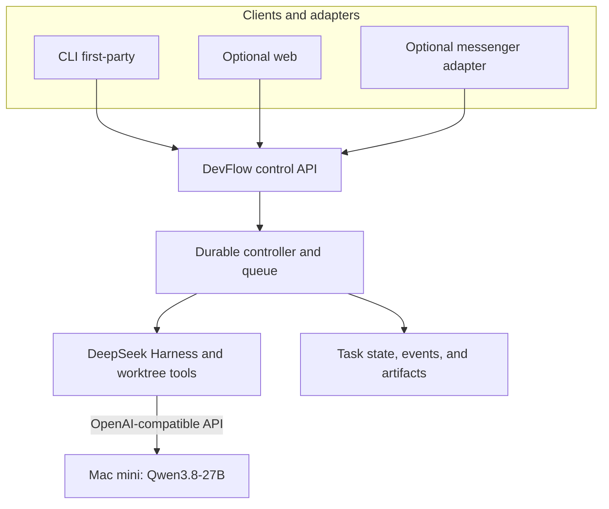
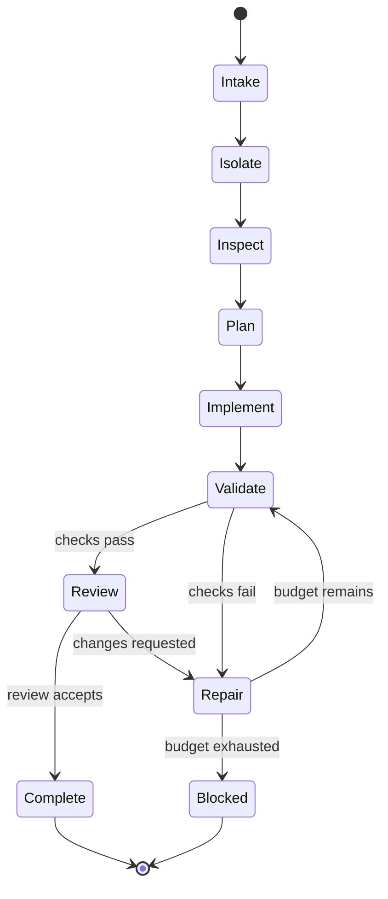

# Qwen 3.8 Local Development Agent

## Technical Architecture Specification

| Field | Value |
| --- | --- |
| Status | Proposed architecture for implementation |
| Version | 0.5 |
| Date | 30 August 2026 |
| Primary model | Official Qwen3.8-27B post-trained model; 4-bit default on 24 GB hosts |
| Inference host | Apple Silicon Mac; 24 GB unified memory is the default profile, not a ceiling |
| Agent harness | DeepSeek Harness (`dsh`), pinned developer-preview release |
| Development host | Separate Linux host by default; same Mac allowed when topology is `colocated` |

## 1. Executive decision

The system will separate **inference** from **software-development execution**. That split is **logical** (processes and trust), not a requirement for two chassis:

- Native Ollama on Apple Silicon runs the official Qwen3.8 model. The default physical layout is a dedicated always-on Mac appliance (`topology: split`).
- DevFlow and DeepSeek Harness own the source repository, shell, language servers, builds, tests, git worktrees, task state, and optional paid-model routes. By default they run on a separate Linux development host.
- They call Ollama through an OpenAI-compatible HTTP endpoint. The model process never mounts the repository and never executes commands, even if Ollama and the harness share one Mac (`topology: colocated`, intended for ~48 GB+ and no sleep).
- Colocation is a bind-address change (`127.0.0.1` instead of a LAN name), not a second architecture. See ADR 0006 and `devflow topology`.
- A durable controller around DeepSeek Harness provides a repeatable automated development lifecycle: isolate a task, inspect, plan, implement, validate, repair, review, and report. It owns the queue, checkpoints, pause/resume behavior, budgets, and recovery; the lifetime of a terminal, browser, messaging adapter, or Harness process does not define the lifetime of a task.
- A channel-neutral interaction gateway exposes the same task through the control API. This repository is the backend (API, CLI, later a thin web view). Messaging clients are optional adapters. Slack is the MVP adapter because it is the easiest outbound path; other messengers are in scope via the same contract. These are control surfaces over one durable task record, not separate agent sessions.
- Large repositories are supported through retrieval and iterative work, not by placing the entire repository in the model context.

The MVP deliberately uses one model and one inference request at a time. It does not use SSD streaming, macOS swap as working memory, automatic production deployment, or concurrent local subagents.

## 2. Goals

### 2.1 Functional goals

1. Serve an official Qwen3.8 model continuously from an Apple Silicon Mac. The default profile targets 24 GB unified memory; larger hosts may select a larger context or official checkpoint.
2. Give DeepSeek Harness reliable access to model thinking, streaming, and function/tool calling.
3. Let the harness autonomously inspect and modify software in isolated git worktrees.
4. Support large repositories through repository discovery, lexical search, symbol navigation, bounded code excerpts, task memory, and context compaction.
5. Automate the normal development loop:
   - understand the task;
   - discover the affected code;
   - plan a bounded change;
   - implement it;
   - run deterministic validation;
   - repair failures;
   - independently review the resulting diff;
   - hand back a tested branch and report.
6. Allow optional paid specialist models later without coupling the workflow to any one provider.
7. Persist enough evidence to replay or audit what an automated task did.
8. Run bounded unattended jobs for several hours or overnight, surviving model, harness, channel, and development-host process restarts without losing repository work or blindly repeating side effects.
9. Provide a task-scoped, conversational development experience with visible plans, progress, diffs, commands, validation results, questions, approvals, and final reports through the control API (CLI first; optional web and optional messaging adapters).

### 2.2 Non-functional goals

- **Low operating cost:** reuse the existing Mac and run the development VM only when required.
- **Private by default:** prompts and repository excerpts remain on the private network unless a task explicitly permits cloud fallback.
- **Recoverable:** every task runs in a separate worktree and branch; the base checkout is not edited.
- **Deterministic completion:** the model cannot declare success without the configured validation gates being executed by the development host.
- **Replaceable components:** the model runtime, agent harness, context broker, and cloud providers communicate through explicit interfaces.
- **Stable operation:** steady-state inference must avoid sustained swap-outs and must survive process or host restarts.
- **Unattended durability:** queued and running tasks are persisted outside the Harness process, use recoverable leases and checkpoints, and do not depend on an attached terminal or browser.
- **Interaction parity:** every supported UI calls the same controller operations and projects the same authoritative task state.
- **Bounded autonomy:** every long-running loop has explicit completion criteria, hard ceilings, no-progress detection, and a safe paused or blocked state.

## 3. Non-goals for the MVP

- Running the full 262K native context on the 24 GB Mac.
- Loading multiple local models at once.
- Parallel Qwen inference or parallel Qwen-backed subagents.
- Training, fine-tuning, or modifying Qwen weights.
- Giving the Ollama/inference process access to git repositories, build tools, credentials, or deployment environments (the Mac may host those processes when `topology` is `colocated`, but they stay separate from Ollama).
- Automatically merging, pushing, releasing, applying infrastructure, or deploying production changes.
- Exposing the inference API or DeepSeek Harness UI to the public internet.
- Treating SSD or macOS swap as a substitute for unified memory.
- Building a vector database before repository-search evaluations show that one is necessary.
- Treating an unbounded prompt loop as a substitute for a durable workflow state machine.
- Sending complete source files, raw shell logs, secrets, or full model trajectories to a messaging service by default.

## 4. Assumptions

1. “Original Qwen3.8-27B” means the official post-trained Qwen model rather than an abliterated, uncensored, merged, or task-specific derivative. The default 24 GB profile requires a 4-bit runtime representation. Larger unified memory may use a higher-quality official quant or a larger official Qwen tag after soak tests. One local model remains loaded at a time.
2. In `split` topology the Mac and development host can reach each other over a trusted private LAN or overlay. In `colocated` topology the endpoint is loopback on one Mac.
3. The inference API trust boundary is that private path (LAN, overlay, or localhost). No public bind. Application auth is still required once any non-loopback client exists.
4. The development host is either:
   - a Linux VM or workstation (`split`), recommended for overnight isolation; or
   - the same Mac as Ollama (`colocated`), for operators with enough unified memory who accept macOS as the unattended host; or
   - a developer laptop for interactive use.
5. Target repositories use git and provide reproducible build/test commands or can be given an external repository profile containing them.
6. Only one automated development task actively uses the local model at a time.
7. The development host or VM remains powered on for overnight work and runs DevFlow under an operating-system service manager rather than an interactive shell.
8. A messaging adapter, if enabled, is an external control and notification channel. Its outage must not stop a running job. Repository content sent to any messenger is governed by channel-output policy. Slack is the MVP adapter only.

## 5. Architecture overview



### 5.1 Trust and execution boundary

The model produces intentions and tool calls. The development host decides whether and how those calls execute.

| Capability | Mac inference host | Development host | External messaging service |
| --- | --- | --- | --- |
| Model weights and decoding | Yes | No | No |
| Repository checkout | No | Yes | No |
| Shell and compiler execution | No | Yes | No |
| Git branches/worktrees | No | Yes | No |
| Test and lint execution | No | Yes | No |
| Session/task state | Minimal runtime logs | Authoritative | Task ID and permitted projection only |
| Raw source and verbose artifacts | No | Yes | Suppressed by default |
| Source-control credentials | No | Optional, policy controlled | No |
| Paid-model credentials | No | Optional, policy controlled | No |
| Messaging credentials | No | Adapter process only | Service-managed identity |

This separation keeps the Mac simple and ensures a model cannot directly act outside the development host’s policy boundary.

## 6. Component architecture

### 6.1 Mac inference node

#### Responsibilities

- Run native Ollama on macOS with Apple Silicon acceleration.
- Keep one official Qwen3.8-27B model resident.
- Expose OpenAI-compatible chat completions, streaming, reasoning-effort control, and tool calls.
- Report model/process state for health checks.
- Restart automatically after login/reboot and preload the model.

#### Baseline model

Initial candidate:

```text
qwen3.8:27b-mlx
```

This is the official Ollama MLX-tagged 18 GB model. Before final promotion, it must be evaluated against the official `qwen3.8:27b` Q4_K_M/MTP tag on the actual M4 Mini. The selected production alias must use the official checkpoint and be recorded by digest.

The architecture starts with MLX because it is the Mac-specific path. It does not assume that higher token throughput automatically means better agent behavior; tool-call correctness and accepted-task rate are promotion gates.

#### Production model alias

The OpenAI-compatible API cannot set context size per request. The deployment therefore creates a stable Ollama model alias with an explicit context window:

```text
qwen38-agent-16k
```

Conceptual Modelfile:

```dockerfile
FROM qwen3.8:27b-mlx
PARAMETER num_ctx 16384
```

The exact upstream model digest, Ollama version, generated alias digest, and sampling contract are recorded in a lock file in the implementation repository.

#### Runtime profile

| Setting | MVP value | Rationale |
| --- | ---: | --- |
| Context window | 16,384 | Conservative 24/7 baseline on 24 GB unified memory |
| KV cache | `q8_0` | Approximately half FP16 KV memory with low expected quality loss |
| Flash Attention | Enabled | Reduces context-memory growth where supported |
| Loaded models | 1 | Prevents model eviction and memory overcommit |
| Parallel requests | 1 | Avoids multiplying context memory |
| Queue | 8 | Provides bounded back-pressure rather than uncontrolled demand |
| Keep alive | Indefinite | Avoids repeated 18 GB model loads |
| Cloud features | Disabled | Keeps the appliance local-only |
| Input modalities | Text in MVP | Avoids unnecessary vision-path complexity |

Planned Ollama environment contract:

```text
OLLAMA_HOST=<private-mac-address>:11434
OLLAMA_CONTEXT_LENGTH=16384
OLLAMA_FLASH_ATTENTION=1
OLLAMA_KV_CACHE_TYPE=q8_0
OLLAMA_MAX_LOADED_MODELS=1
OLLAMA_NUM_PARALLEL=1
OLLAMA_MAX_QUEUE=8
OLLAMA_KEEP_ALIVE=-1
OLLAMA_NO_CLOUD=1
```

The service binds only to the trusted private-network address. It does not bind to a publicly routed interface.

#### Hardware profiles

24 GB / 16K is the **default reference profile**, not a product constraint. Named profiles live in `config/inference/profiles.yaml` and are listed by `devflow profiles`. Operators with 36 GB, 48 GB, or 64 GB+ unified memory may select a larger context or a larger official Qwen tag. Changing the *repository default* is an ADR; selecting a non-default profile on one host is configuration. See ADR 0004.

#### Capacity-expansion profile

A `qwen38-agent-32k` alias (`m24-qwen38-32k` or `m36-qwen38-32k`) may be evaluated after the 16K profile passes soak testing. It is not the repository default. Promotion requires:

- green macOS memory pressure under representative multi-turn tasks;
- no sustained growth in swap-outs;
- stable tool-call completion;
- no material latency regression that reduces accepted-task throughput;
- no model or Ollama termination during the 24-hour promotion soak.

### 6.2 Private network

The network supplies a stable private hostname, for example:

```text
mac-inference.internal
```

The API endpoints used are:

| Endpoint | Purpose |
| --- | --- |
| `POST /v1/chat/completions` | Model inference, streaming, tools, reasoning control |
| `GET /v1/models` | Provider discovery and conformance check |
| `GET /api/version` | Ollama health/version check |
| `GET /api/ps` | Loaded-model and residency check |

No application authentication is added. DeepSeek Harness supplies the dummy key value `ollama` only because OpenAI-compatible clients expect a key field; Ollama ignores it.

### 6.3 Development host

The development host contains eight logical components.

#### A. DevFlow controller

A small service with a command-line client that provides the stable workflow boundary around the rapidly evolving harness.

Responsibilities:

- accept task manifests;
- expose a channel-neutral task and conversation API;
- persist a durable lifecycle state machine and task queue;
- create and retain isolated worktrees;
- launch or resume DeepSeek Harness sessions through ACP;
- supervise Harness workers with leases, heartbeats, cancellation, and restart recovery;
- select reasoning effort by workflow phase;
- enforce time, turn, diff, path, and command budgets;
- checkpoint structured state and reconcile interrupted tool actions;
- run independent validation outside the agent conversation;
- decide whether to continue, retry, ask for help, or stop;
- assemble the final task report;
- optionally route an allowed task to a paid model.

The controller should be small and should not reimplement the model’s agent loop. DeepSeek Harness remains responsible for model/tool interaction.

#### B. DeepSeek Harness

DeepSeek Harness provides:

- the agent loop;
- custom model-provider configuration;
- shell, editor, filesystem, LSP, plan, todo, goal, job, and session capabilities;
- workspace-write sandboxing;
- append-only session trajectories;
- context compaction;
- interactive Web UI for supervised sessions;
- ACP for programmatic/headless sessions.

The harness is currently a developer preview. The implementation must pin an exact release rather than using `latest`, and upgrades must pass the local evaluation suite before promotion.

#### C. Local Qwen provider adapter

DeepSeek Harness uses a custom OpenAI-completions provider pointing at Ollama:

```yaml
llm-pi-ai:
  providers:
    mac-qwen:
      displayName: Mac mini Qwen 3.8
      apiKeyEnv: MAC_QWEN_API_KEY
      api: openai-completions
      baseURL: http://mac-inference.internal:11434/v1
      compat:
        supportsDeveloperRole: false
      models:
        - id: qwen38-agent-16k
          name: Qwen 3.8 27B Local 16K
          contextWindow: 16384
          maxTokens: 8192
          input: [text]
          reasoningEfforts:
            off: none
            low: low
            medium: medium
            high: high
            max: max
```

This is an architectural configuration shape. The exact field set must be contract-tested against the pinned DeepSeek Harness release. In particular, tool-call serialization, system/developer roles, reasoning fields, and replay of assistant reasoning must be validated before unattended execution.

#### D. Workspace manager

The workspace manager creates one branch and git worktree per task:

```text
branch:   agent/<task-id>
worktree: <workspace-root>/<repo-id>/<task-id>
```

Rules:

- Never edit the canonical/base checkout.
- Never run two tasks in the same worktree.
- Retain failed and blocked worktrees for diagnosis.
- Do not delete a successful worktree until its branch and report have been handed off.
- Do not push, merge, rebase shared branches, or deploy in the MVP.

For large repositories, use a local bare mirror or canonical clone plus worktrees so task creation does not duplicate the complete repository.

#### E. Repository context broker

The context broker gives the model small, relevant, evidence-backed context packets. It is implemented initially through DeepSeek Harness filesystem/LSP tools plus controller policy; it may later become a native Harness plugin.

Retrieval order:

1. Repository and workspace instructions such as `AGENTS.md`, README files, and external repository profiles.
2. Tracked-file inventory from git, excluding generated/vendor/build directories.
3. Dependency and build manifests.
4. Lexical search with `rg` for identifiers, errors, routes, schemas, and tests.
5. Symbol definition/reference navigation through the appropriate language server.
6. Adjacent tests, callers, implementations, and configuration.
7. Git history or blame only when the task needs design intent.
8. Bounded file excerpts rather than whole files wherever possible.

The broker maintains a structured task memory outside the model transcript:

- objective and acceptance criteria;
- repository facts and commands;
- plan and current step;
- files inspected and why they matter;
- files changed;
- tests executed and results;
- unresolved hypotheses;
- blockers and next actions.

This task memory is reinjected after compaction or fresh-session review. Old free-form reasoning is not treated as durable memory.

#### F. Validation and policy engine

The validation engine executes deterministic gates independently of the model’s claim of completion:

- formatting;
- linting;
- static analysis/type checking;
- targeted tests;
- broader tests where time permits;
- build/package verification;
- generated-file or schema checks;
- path and diff-policy checks;
- secret scanning where configured;
- `git diff --check` and clean status inspection.

Repository-specific commands live in an external versioned profile. An existing `AGENTS.md` remains model guidance but is not the sole machine-readable source of validation commands.

#### G. Durable job runner and supervisor

DevFlow—not DeepSeek Harness—owns task lifetime. The runner is an operating-system service and continues when the initiating CLI exits, a browser closes, or a messaging adapter disconnects.

Each task stores a coarse lifecycle state and a separate workflow stage:

| Lifecycle state | Meaning |
| --- | --- |
| `queued` | Accepted and waiting for the single local-model execution slot |
| `running` | A worker holds a renewable lease and is advancing the workflow |
| `awaiting_input` | A material question or approval is outstanding; the inference slot is released |
| `retry_wait` | A bounded infrastructure retry is scheduled |
| `paused` | Deliberately stopped at a safe boundary with all state retained |
| `complete` | Required gates and review passed |
| `blocked` | Work cannot continue without a policy, dependency, or human decision |
| `failed` | Infrastructure or workflow execution ended without a valid continuation |
| `cancelled` | A user or policy cancelled the task; worktree and evidence remain available |

Durability rules:

- A worker obtains a time-limited lease and emits heartbeats. After restart, the scheduler reclaims only expired leases.
- Every model turn, tool request, tool result, stage transition, question, answer, approval, and cancellation is written to an append-only event log with a stable identifier.
- Before a tool action, the runner records its action identifier and intent. After execution it records exit status, relevant output, repository diff fingerprint, and resulting checkpoint.
- If a crash occurs between execution and result persistence, the task enters reconciliation. DevFlow inspects the worktree and action evidence; it never blindly reruns an action whose outcome is unknown.
- A valid Harness session may be resumed. If it cannot be resumed, DevFlow starts a fresh session from the objective, acceptance criteria, structured task memory, current diff, and validation evidence.
- Pause and cancellation are cooperative at safe boundaries. A non-responsive child process receives a bounded grace period before termination; its worktree is never discarded automatically.
- Waiting for a human, an unavailable Mac, or a messaging outage does not consume model turns. Active and wall-clock budgets are recorded separately.

Initial execution profiles are configuration rather than hard-coded behavior:

| Profile | Active time | Model turns | Repair cycles | No-progress limit |
| --- | ---: | ---: | ---: | ---: |
| `standard` | 90 minutes | 8 | 3 | 2 consecutive attempts |
| `overnight` | 8 hours | 30 | 6 | 2 consecutive attempts |

The overnight profile increases time for investigation, builds, and tests; it does not permit an infinite agent loop or expand change-control permissions.

#### H. Interaction gateway and channel adapters

The interaction gateway presents one controller contract to every UI:

- create or schedule a task;
- add a message or answer to an existing task;
- inspect objective, plan, current stage, budget, todo state, diff summary, commands, tests, and blockers;
- pause, resume, or cancel;
- approve or reject a specifically described gated action;
- request a review or final report;
- open the retained worktree or branch from a development-capable client.

The DevFlow API binds to a Unix socket or loopback interface by default. If the web client is used from another machine, access is through the private network or overlay with controller authentication; the API is never exposed directly to the public internet.

Every conversational surface binds to the stable task identifier. A messenger thread or DM (Slack is the MVP example) may create a task; follow-ups continue that task and do not silently create new Harness sessions. Duplicate channel events are discarded using their source event identifier.

Slack is the **MVP adapter** only: easiest outbound path (Socket Mode, threads). This repo does not ship a Slack product. Any adapter must:

- acknowledge vendor interactions immediately and perform all long work asynchronously;
- authenticate with dedicated app and bot tokens stored outside repositories;
- allow only configured workspace, channel, and user identities;
- translate messages and button actions into typed DevFlow API commands rather than shell strings;
- remain unable to call the model, shell, git, or deployment systems directly;
- post concise stage changes, questions, approval requests, failures, and completion summaries rather than token-by-token model output;
- expose source excerpts and full logs only on explicit request and under channel-output policy;
- reconnect with backoff without changing the underlying task state.

Any cloud messenger is an external data processor even though model inference remains local. The default policy therefore permits objectives, high-level progress, test summaries, and diff statistics, but suppresses secrets, environment values, raw trajectories, and large source excerpts. Matrix, Discord, or another adapter implements the same gateway contract; do not fork the controller.

### 6.4 State and storage

The MVP requires no server database.

| State | Storage |
| --- | --- |
| Task queue, lifecycle, leases, and budgets | SQLite in WAL mode on development host |
| Questions, approvals, and channel/thread bindings | SQLite on development host |
| Harness trajectories | DeepSeek Harness session store/JSONL |
| Append-only controller events and reports | Filesystem plus SQLite index |
| Repository task changes | Git worktree and task branch |
| Build/test outputs | Per-task artifact directory |
| Model/runtime locks | Implementation repository |

All state directories are outside target repositories unless a repository explicitly adopts committed agent configuration. SQLite and artifact directories are backed up through development-host snapshots; a successful database commit is required before a task acknowledgement is returned to any UI.

## 7. Model interaction strategy

### 7.1 Phase-specific reasoning

Qwen3.8 thinks by default and can consume substantial time and context. The controller sets effort deliberately:

| Workflow phase | Default effort | Escalation |
| --- | --- | --- |
| Repository triage/search | Low | Medium if search is ambiguous |
| Change planning | Medium | High for architectural or cross-cutting work |
| Implementation | Medium | High only after a failed approach |
| Test-failure diagnosis | Medium | High on the final local repair attempt |
| Fresh diff review | High | Paid reviewer if allowed and still uncertain |
| Simple formatting/mechanical edits | Off or low | None |

Maximum reasoning is not the default. The objective is accepted changes per hour, not maximum tokens per answer.

### 7.2 Context budget

For the 16K model profile, a typical turn should target:

| Context element | Target budget |
| --- | ---: |
| System, tool schemas, and repository policy | 2K–3K tokens |
| Structured task memory and plan | 1K–2K tokens |
| Retrieved code and diagnostics | 5K–7K tokens |
| Reserved model output/reasoning | 5K–8K tokens |

The broker must prefer another focused model turn over stuffing more source into one prompt.

DeepSeek Harness compaction should begin before exhaustion, initially around 70–75% of the declared context. Compaction retains structured task state, recent decisions, changed files, and test evidence while dropping stale searches, duplicated tool output, and superseded reasoning.

### 7.3 Tool-result discipline

- Limit command output at the source where possible.
- Persist long build logs as artifacts and return only the failure summary plus relevant lines.
- Never put dependency directories or minified/generated assets into model context.
- Return line-numbered excerpts around search matches.
- After each edit, present the model with the diff or affected region rather than the complete repository.
- Treat compiler and test output as higher-value evidence than model speculation.

### 7.4 Sampling defaults

The official Qwen recommendations remain the starting point:

- thinking: temperature `1.0`, top-p `0.95`, top-k `20`, min-p `0.0`;
- non-thinking: temperature `0.7`, top-p `0.8`, top-k `20`.

The evaluation suite may override these only when accepted-task evidence supports the change.

## 8. Automated development workflow



### 8.1 Task manifest

Each automated task is explicit and reproducible:

```yaml
id: task-123
repository: example-service
base_ref: origin/main
objective: Add optimistic locking to order updates
acceptance_criteria:
  - Concurrent updates cannot silently overwrite each other
  - Existing API behavior remains backward compatible
allowed_paths:
  - src/**
  - tests/**
validation_profile: standard
mode: unattended
execution_profile: overnight
cloud_allowed: false
time_budget_minutes: 480
max_model_turns: 30
max_repair_cycles: 6
no_progress_limit: 2
on_human_input_required: pause
max_changed_lines: 600
```

### 8.2 Workflow stages

#### Stage 1 — Intake and policy

- Validate required fields.
- Classify the task as analysis-only, normal code change, dependency change, data migration, infrastructure, or external-side-effect work.
- Refuse or request explicit approval for out-of-policy operations.
- Establish time, turn, repair, no-progress, command, and diff budgets.
- Bind the task to its initiating conversation, if any, and acknowledge it only after durable persistence.

#### Stage 2 — Isolation

- Resolve the base commit.
- Create `agent/<task-id>` and its worktree.
- Record the original commit and repository status.
- Load the repository profile and instructions.

#### Stage 3 — Inspection

- Inventory the relevant repository structure.
- Identify build system, language servers, tests, and ownership boundaries.
- Search for affected symbols and adjacent tests.
- Write initial structured task memory.

#### Stage 4 — Plan

- Ask Qwen for a bounded implementation plan tied to acceptance criteria.
- Require named files, tests, assumptions, and rollback implications.
- In interactive mode, allow plan approval.
- In workspace-auto mode, continue only when the plan stays within the task policy.

#### Stage 5 — Implement

- Make small patches.
- Inspect the diff after each coherent change.
- Run the narrowest useful check early.
- Keep task memory synchronized with actual repository state.

#### Stage 6 — Validate and repair

- Run configured deterministic gates.
- Return concise diagnostics to the agent.
- Permit a bounded repair loop.
- Require evidence of progress between attempts; repeated identical failures stop the loop.

Initial default budgets:

- up to 3 implementation/repair cycles for a normal task;
- up to 8 significant model turns;
- up to 90 minutes active execution time;
- one explicit extension permitted by a human or policy rule.

These values are configuration, not hard-coded behavior.

For an overnight task, the `overnight` execution profile supplies the larger ceilings in Section 6.3.G. The controller may stop earlier when acceptance criteria are met, progress stalls, policy is reached, or a material decision requires human input. It may not silently extend any ceiling.

#### Stage 7 — Fresh review

Start a fresh Qwen session with:

- the original task and acceptance criteria;
- the final diff;
- relevant tests and their results;
- the structured task summary;
- no implementation conversation.

The fresh reviewer looks for missed requirements, regressions, unsafe assumptions, incomplete tests, and unnecessary changes. This reduces anchoring on the implementation session.

#### Stage 8 — Completion

The controller—not the model—sets the final status:

- `complete`: all required checks pass and review has no blocking finding;
- `blocked`: a concrete dependency, permission, ambiguity, or budget limit prevents completion;
- `failed`: infrastructure or harness execution failed without a recoverable task state;
- `cancelled`: an authorized user or policy ended the task and the retained worktree/evidence describe any partial result.

The output includes:

- branch and worktree;
- base and final commits;
- changed-file summary;
- acceptance-criteria disposition;
- commands/tests run and results;
- reviewer findings;
- remaining risks or manual steps;
- session/trajectory references;
- local and optional cloud usage metrics.

### 8.3 Developer interaction contract

The product experience should capture the useful workflow properties of modern AI coding tools without coupling them to a particular UI or Harness implementation:

1. **One task, one durable conversation.** The task, plan, worktree, model sessions, questions, approvals, and evidence share one identifier across the CLI, optional web, and any messaging adapter.
2. **Grounded repository awareness.** Model claims and proposed changes reference concrete paths, symbols, callers, tests, and diff hunks. Search and LSP evidence are available without flooding the conversation.
3. **Clear working modes.** `review-only` answers and investigates; `interactive` proposes and asks at key boundaries; `workspace-auto` executes a bounded change; `unattended` adds durable scheduling and asynchronous escalation.
4. **Visible plan and progress.** The UI can show acceptance criteria, current stage, current todo, active command, elapsed and remaining budgets, changed files, and latest validation state without querying the model.
5. **Diff-first review.** The authoritative output is the branch/worktree diff plus validation evidence. Chat summaries never replace inspectable code changes.
6. **Checkpoints and undo.** DevFlow records safe stage checkpoints and can restore a task to a prior checkpoint or abandon its complete worktree without touching the base checkout.
7. **Tests as first-class evidence.** Commands, exit codes, concise diagnostics, and artifact links are attached to the task. A green-looking chat response cannot override a failing gate.
8. **Background execution.** Closing a client detaches from the task; it does not cancel it. Reopening from any channel reconstructs state from DevFlow, not from client-local history.
9. **Material interruptions only.** The agent asks when ambiguity changes the implementation materially, an approval boundary is reached, or safe progress is impossible. Questions include the decision, bounded options, a recommendation, and the effect of waiting.
10. **Clean handoff.** Completion provides the branch, diff summary, acceptance-criteria result, tests, risks, and suggested next action. The user can continue the same conversation for a follow-up task while DevFlow creates a new isolated worktree when required.

The exact widgets, message blocks, slash commands, ACP calls, and Harness plugin points are implementation details. These ten behaviors are architecture-level acceptance contracts and should be tested independently of the selected UI.

### 8.4 Asynchronous questions and approvals

Questions and approvals are durable records, not ephemeral chat prompts:

- Each record includes task, workflow stage, requesting actor, reason, options, recommendation, creation time, and status.
- An approval additionally includes the exact action class, affected paths or external target, and a digest of the proposed action. Approval of one action cannot authorize a modified action.
- The task moves to `awaiting_input`, releases the local inference slot, and may notify every subscribed channel.
- The first valid authorized response resolves the record transactionally. Later or duplicate responses are acknowledged but ignored.
- Approval timeout behavior is explicit: pause indefinitely, block after a deadline, or apply a pre-authorized safe default. Silence never implies approval.
- Answers become structured task events and are supplied to the resumed Harness session with the current repository and validation state.

## 9. Automation modes

| Mode | Behavior |
| --- | --- |
| `review-only` | Read/search/analyse; no repository writes |
| `interactive` | Model proposes plans and edits; user approves key actions |
| `workspace-auto` | Default autonomous mode; unrestricted worktree edits and tests, no external side effects |
| `unattended` | Durable queued `workspace-auto` execution using `standard` or `overnight` profiles, with strict budgets and asynchronous pause/escalation |

Even in unattended mode, the MVP does not merge, push, deploy, publish packages, apply migrations, or alter external systems.

## 10. DeepSeek Harness orchestration policy

### 10.1 Standard and headless paths

- Use the DSH Web UI for interactive development and trajectory inspection.
- Use DSH ACP from DevFlow for queued/headless tasks.
- Keep both paths on the same pinned provider configuration and repository policies.
- Treat the DSH Web UI as an inspection or supervised interaction surface, not the authoritative job store. Closing it must not terminate a controller-owned task.
- Run ACP sessions as supervised children with task identifiers, health heartbeats, bounded cancellation, and resumable session references.

### 10.2 Subagents and workflows

The local Mac has one inference stream. Consequently:

- local-model subagent fan-out is disabled or serialized;
- model-authored workflows use concurrency `1` on the local route;
- parallelism is reserved for deterministic host tools such as independent lint/test commands;
- cloud-backed subagents may run concurrently only when explicitly configured and budgeted.

DeepSeek Harness’s Ralph workflow may be introduced for bounded fresh-agent repair loops. It cannot certify completion by itself: DSH documents that Ralph completion is a worker report. DevFlow’s independent validation remains authoritative. Initial Ralph ceiling: three rounds.

## 11. Paid-model extension

The architecture allows additional DSH providers without changing the Mac endpoint.

### 11.1 Routing policy

Local Qwen remains the default. A paid route is eligible only when `cloud_allowed: true` and one of these conditions occurs:

- relevant context cannot be reduced to the local window;
- two tool-call/schema repair attempts fail;
- three code-repair cycles do not improve validation evidence;
- the task is explicitly classified for a specialist model;
- an independent external review is requested.

### 11.2 Cost and privacy controls

- Set a per-task monetary/token budget.
- Record which excerpts were sent externally.
- Prefer cloud planning or review before granting cloud models tool execution.
- Never silently escalate a `cloud_allowed: false` task.
- Keep cloud provider credentials on the development host only.

## 12. Operational architecture

### 12.1 Mac startup and recovery

The implementation will provide a native macOS launch configuration that:

1. starts Ollama with the production environment;
2. waits for `/api/version`;
3. verifies the expected model digest;
4. preloads `qwen38-agent-16k` with indefinite keep-alive;
5. records startup/health failures;
6. restarts the process if it exits unexpectedly.

The Mac should be configured not to sleep while acting as an inference node and to restart after power loss where the environment permits.

### 12.2 Development-host services

Recommended processes:

- `devflow-api`: channel-neutral task, conversation, approval, and evidence API;
- `devflow-scheduler`: durable queue, leases, budgets, and recovery;
- `devflow-worker`: single local-model execution worker and ACP supervisor;
- pinned DeepSeek Harness runtime, launched or attached per task;
- optional `devflow-slack`: isolated Socket Mode channel adapter;
- optional DSH Web UI bound locally or to the private network;
- repository language servers and build toolchains;
- SQLite task state;
- lightweight health poller for the Mac endpoint.

The API, scheduler, worker, and enabled channel adapters run under `systemd` or the development host’s equivalent service manager with automatic restart and bounded restart backoff. On a dedicated Linux host, Docker Compose (`deploy/compose`) is the recommended packaging for those processes; a full VM is optional extra isolation. Ollama stays native on the Mac. The worker count for the local Qwen route is one. Optional messaging adapters (Slack MVP) dial out. CLI/web from another network uses a private overlay, not a public bind. See ADR 0005, ADR 0007, and `docs/channels.md`.

### 12.3 Health states

| State | Definition | Controller action |
| --- | --- | --- |
| Healthy | API responds, expected model loaded, memory pressure acceptable | Accept work |
| Cold | API responds but model not resident | Preload and wait |
| Busy | One request active and queue below limit | Queue one task |
| Degraded | Swap-outs rise, response stalls, or wrong model/version loaded | Stop new work; finish/cancel current work |
| Unavailable | API/network fails | Pause task and preserve state |

Automatic cloud failover is disabled unless the task explicitly permits cloud use.

### 12.4 Timeouts and retry behavior

- Fast connection timeout to identify an unavailable Mac.
- Long total inference timeout because medium/high reasoning can take minutes.
- Retry transient connection, 429, or 503 failures with bounded exponential backoff.
- Do not retry indefinitely.
- If a stream fails before a tool call is committed, retrying the model turn is safe.
- Once a tool action executes, resume from recorded tool evidence rather than replaying the action blindly.
- Track model-stream liveness separately from total turn duration so a legitimately slow reasoning turn is not mistaken for a dead process.
- Exclude explicit `awaiting_input` time from active-execution budgets while still recording total wall-clock age.

### 12.5 Startup recovery and action reconciliation

On development-host service startup, DevFlow:

1. opens and verifies the SQLite store and event log;
2. scans non-terminal tasks and reclaims expired worker leases;
3. verifies each worktree, branch, base commit, and current diff fingerprint;
4. classifies the last action as completed, safe to retry, or requiring reconciliation;
5. checks Mac and Harness health;
6. resumes runnable tasks in queue order and leaves human-paused tasks untouched;
7. emits one recovery event and channel notification rather than constructing a new task.

Arbitrary shell commands cannot be made exactly-once across every possible host crash. DevFlow therefore guarantees **at-most-once automatic replay**: an action with an uncertain outcome is reconciled from filesystem, git, process, and captured-command evidence or is escalated. It is never automatically issued twice merely because its result event is missing.

The development host should use persistent storage with routine snapshots. A laptop can run interactive jobs, but a small always-on Linux VM is the recommended control plane for overnight execution.

### 12.6 Messaging adapters (Slack is the MVP)

This repo is the backend. Adapters are optional. The Slack adapter, if you use it, runs independently of the worker and uses outbound Socket Mode. No vendor webhook, inference endpoint, Harness UI, or DevFlow API needs to be exposed publicly.

Initial conversational behavior:

- DM the bot or mention it with either an `ask` request for a `review-only` conversation or a `task` request for a worktree-backed development workflow. Ambiguous requests are normalized and confirmed before repository writes.
- The bot replies with normalized repository, base ref, mode, execution profile, acceptance criteria, and budgets; starting execution is an explicit action unless a configured channel is pre-authorized for automatic intake.
- The bot creates or binds a dedicated thread and posts only meaningful stage transitions.
- Natural-language follow-ups in the bound thread become task messages. Explicit controls such as `status`, `pause`, `resume`, `cancel`, `diff`, `tests`, `approve`, and `reject` are also available as buttons or commands.
- Long operations are acknowledged immediately; later messages carry progress or results.
- Questions and approvals remain resolvable through CLI or web if Slack is unavailable.
- Completion posts a concise report and stable task identifier. Large diffs and logs remain on the development host and are retrieved on demand.

The adapter requires an egress path to Slack and therefore is optional. A task continues normally during a Slack outage; only notifications and Slack-originated responses are delayed.

## 13. Observability and evidence

### 13.1 Per model turn

- task/session/turn identifiers;
- provider, model alias, and model digest;
- reasoning effort;
- input/output token counts when available;
- time to first token;
- prompt and decode duration/throughput when available;
- tool calls requested, accepted, rejected, or repaired;
- finish reason and error class;
- context compaction events.

### 13.2 Per task

- elapsed time;
- number of model turns and repair cycles;
- changed lines/files;
- validation pass/failure timeline;
- final status;
- human intervention count;
- pause, resume, recovery, and reconciliation events;
- active-execution time versus total wall-clock age;
- originating channel and notification delivery state;
- cloud tokens/cost when applicable;
- accepted-task rate over the evaluation corpus.

### 13.3 Mac capacity indicators

- model residency from `ollama ps`/`/api/ps`;
- macOS memory-pressure state;
- swap usage and, more importantly, the rate of page-outs;
- process restarts and termination causes;
- queue depth and request duration.

A static non-zero swap allocation is not itself a failure. Sustained page-out growth during ordinary inference is a degradation signal.

## 14. Failure handling

| Failure | Response |
| --- | --- |
| Invalid tool-call JSON | One schema-focused repair; then fresh model turn; then block/escalate |
| Repeated identical tool call | DSH guard plus controller stop condition |
| Context overflow | Compact; create a structured handoff; resume in a fresh session |
| Mac unavailable | Pause with worktree/session intact; resume after health returns |
| Model process crash | Restart Ollama, verify digest, preload, resume last safe model turn |
| Development-host or controller restart | Reclaim expired lease, verify worktree, reconcile last action, then resume |
| Harness child crashes | Restart from valid session reference or fresh structured handoff; preserve task identity |
| Slack disconnects | Continue task; reconnect with backoff; deliver current state rather than replaying every missed progress message |
| Duplicate Slack event or approval | Deduplicate by source identifier and resolve the durable record once |
| Cancellation during a command | Request cooperative termination, enforce grace timeout, record partial outcome, and reconcile before any resume |
| Test failure | Bounded diagnosis/repair loop using concise diagnostics |
| No progress across repairs | Fresh reviewer, then block or allowed paid-model escalation |
| Diff exceeds policy | Stop and request decomposition/approval |
| Write outside worktree | Deny through sandbox; mark infrastructure/policy failure |
| Harness upgrade breaks provider | Roll back pinned version and open a compatibility task |

## 15. Safety and change-control boundaries

The inference network itself has no extra application security by design. Autonomous code execution still requires filesystem and side-effect boundaries.

Default policy:

- DSH shell runs in `workspace-write` mode.
- The controller supplies only task-relevant environment variables.
- Ambient cloud, production, and deployment credentials are scrubbed.
- Network package downloads may be permitted by repository profile; external mutations are not.
- Dependency-lock changes, database migrations, infrastructure changes, and generated large diffs require explicit policy or human approval.
- Push, merge, release, deploy, email, ticket updates, and other external actions are prohibited in the MVP.
- Chat and messaging payloads are parsed into typed controller commands; raw message text is never interpolated into a shell command.
- Slack workspace, channel, and user allowlists are enforced at the adapter and controller layers.
- Slack tokens and channel credentials are not exposed to DeepSeek Harness, Qwen, build commands, or target repositories.
- Approval records are scoped to one task and one immutable action digest; broad conversational agreement is not executable authorization.
- Channel-output policy redacts secrets and suppresses raw source, full trajectories, and verbose logs by default.

## 16. Key architecture decisions

| Decision | Choice | Reason |
| --- | --- | --- |
| Inference location | Dedicated M4 Mac mini | Reuses owned hardware and unified memory |
| Execution location | Separate dev host | Keeps repositories, tools, and risk away from inference appliance |
| Mac runtime | Native Ollama; MLX tag evaluated first | Mac-specific acceleration, stable API, simple operations |
| API boundary | OpenAI Chat Completions | Supported by Ollama and DSH custom providers; tools and reasoning included |
| Default context | 16K with q8 KV | Stable 24 GB baseline; large-repo support comes from retrieval |
| Concurrency | One local inference request | Prevents multiplied KV allocation and throughput collapse |
| Harness | DeepSeek Harness | Plugin architecture, tool loop, sessions, sandbox, workflows, ACP |
| Harness integration | Durable external DevFlow control plane | Insulates the workflow from developer-preview churn and supplies queueing, recovery, interaction, and deterministic gates |
| Task lifetime | DevFlow state machine, events, leases, and checkpoints | Allows overnight execution and restart recovery independent of clients or Harness processes |
| Developer experience | Task-scoped plan, progress, diff, evidence, and conversation contract | Preserves productive coding-agent workflows across replaceable clients |
| Messaging | Channel-neutral backend; Slack is the MVP adapter only | Conversational control without publishing an inbound API or coupling the product to one vendor |
| Repository isolation | Git worktree per task | Recoverability and concurrent task safety |
| Long-term task memory | Structured external state | Survives compaction without replaying long reasoning traces |
| Completion authority | Controller validation | Models cannot self-certify tests or acceptance criteria |
| Large-repo retrieval | Git + `rg` + LSP first | Lower complexity than premature vector infrastructure |

## 17. Risks and mitigations

| Risk | Impact | Mitigation |
| --- | --- | --- |
| DSH is a developer preview | Breaking configuration/API changes | Pin release, isolate adapter, run conformance/evaluation suite before upgrades |
| Ollama/DSH reasoning or role mismatch | Failed multi-turn/tool calls | Provider contract tests; force system role; pin compatible versions |
| 18 GB model leaves limited headroom | Swap and instability | 16K context, q8 KV, one model, one request, dedicated host, soak test |
| Qwen overthinks simple work | Very slow tasks and context exhaustion | Phase-specific reasoning effort, output/turn budgets, iterative tasks |
| Large repository exceeds model context | Missed dependencies or poor changes | Context broker, LSP, lexical search, structured memory, task decomposition |
| Model incorrectly claims completion | Defective handoff | Independent validation and fresh-session review |
| Automated shell damages workspace | Lost work or unrelated edits | Worktree isolation, workspace-write sandbox, path/diff policy |
| Same-model reviewer shares blind spots | Defects survive review | Fresh context, deterministic checks, optional paid independent reviewer |
| Local endpoint unavailable | Task interruption | Persist task/worktree/session state; pause/resume; explicit cloud failover only |
| Long unattended loop consumes time without progress | Wasted runtime or damaging churn | Hard budgets, stage ceilings, two-attempt no-progress limit, deterministic gates, pause/block outcomes |
| Crash occurs around a shell side effect | Duplicate or ambiguous action | Intent/result action ledger, diff fingerprints, reconciliation state, no blind replay |
| Controller database or disk is lost | Task and audit-state loss | Persistent VM disk, WAL mode, filesystem artifacts, routine host snapshots, retained git worktrees |
| Slack is unavailable | Lost control-channel messages | Task execution independent of adapter; reconnect/backoff; CLI and web remain authoritative alternatives |
| Repository or secrets leak through Slack | Privacy or credential exposure | Minimal summaries, output policy, redaction, allowlists, no raw trajectories or environment values |
| Unauthorized Slack action controls a task | Unsafe pause, cancellation, or approval | Workspace/channel/user allowlists, typed commands, immutable scoped approvals, complete audit events |

## 18. Evaluation and promotion gates

Before unattended use, create a representative evaluation corpus containing:

- single-file bug fix;
- multi-file feature with tests;
- unfamiliar repository navigation;
- compile/type error repair;
- flaky or misleading test output;
- tool-call argument generation;
- context compaction and session resume;
- large-repository symbol/reference search;
- forbidden-path and forbidden-command cases;
- Mac restart during a paused task;
- Harness termination immediately before and after a tool result;
- development-host controller restart while a task lease is active;
- uncertain command-result reconciliation without duplicate execution;
- Slack disconnect/reconnect and duplicate-event delivery;
- an overnight task that pauses for a question and resumes hours later from another channel;
- cancellation during a long-running build or test.

Compare at least:

1. `qwen3.8:27b-mlx` at 16K/q8 KV;
2. official `qwen3.8:27b` Q4_K_M/MTP at 16K/q8 KV.

Promotion is based on:

- accepted-task rate;
- tool-call correctness;
- first-pass and eventual validation success;
- median task time;
- memory stability and swap-out rate;
- model/harness crash rate;
- review defect-detection rate;
- successful restart/resume rate;
- duplicate-side-effect count, which must remain zero in evaluation;
- time to recover an expired lease;
- question and approval delivery/resolution correctness across channels.

Raw token-generation speed is secondary.

Before promoting unattended overnight mode, the system must also pass:

- a 24-hour inference-appliance soak at representative duty cycle without sustained page-out growth or unrecovered model failure;
- an 8-hour unattended controller soak containing multiple tasks, at least one injected Harness restart, and one temporary Mac-endpoint outage;
- recovery of every retained worktree and non-terminal task after a controlled development-host reboot;
- a channel test proving that a Slack-originated task can be started, inspected, answered, paused, resumed, cancelled, and completed without terminal access;
- a policy test proving that Slack cannot authorize a changed action by replaying an earlier approval.

## 19. Proposed implementation-repository shape

```text
qwen-local-dev-agent/
├── README.md
├── AGENTS.md
├── .env.example
├── Makefile
├── docs/
│   ├── setup.md
│   ├── channels.md
│   ├── remote-access.md
│   ├── architecture.md
│   ├── operations.md
│   ├── unattended-operations.md
│   ├── interaction-contract.md
│   ├── task-manifest.md
│   └── adrs/
├── deploy/
│   └── compose/
├── config/
│   ├── inference/
│   │   └── profiles.yaml
│   ├── deploy/
│   │   └── topology.yaml
│   ├── access/
│   │   └── remote.yaml
│   ├── mac/
│   │   ├── Modelfile.16k
│   │   ├── Modelfile.32k
│   │   └── ollama.launchd.plist.template
│   ├── dsh/
│   │   ├── settings.yaml.template
│   │   └── profile.patch.yml
│   ├── policies/
│   │   └── default.yaml
│   ├── channels/
│   │   └── slack-app-manifest.yaml.template
│   └── repositories/
│       └── example.yaml
├── src/
│   ├── api/
│   ├── controller/
│   ├── scheduler/
│   ├── worker/
│   ├── workspace/
│   ├── context/
│   ├── validation/
│   ├── providers/
│   ├── approvals/
│   ├── channels/
│   │   └── slack/
│   └── reporting/
├── scripts/
│   ├── bootstrap-mac.sh
│   ├── bootstrap-dev-host.sh
│   ├── health-check.sh
│   └── smoke-test.sh
├── evals/
│   ├── tasks/
│   ├── fixtures/
│   └── expected/
└── tests/
    ├── unit/
    ├── contract/
    └── integration/
```

## 20. Implementation sequence

Dedicated, agent-executable slices of this sequence are tracked in
[`docs/backlog/`](backlog/README.md) (B01–B16). The phase list below
remains the authority for order and intent; backlog files must not
invent a second architecture.

### Phase 1 — Inference appliance

- Install/pin native Ollama.
- Pull both official candidate tags.
- Create the 16K alias.
- Apply single-model/single-request/q8-KV settings.
- Add launch/restart/preload behavior.
- Run inference and memory soak tests.

### Phase 2 — Harness conformance

- Pin DeepSeek Harness.
- Configure the custom Mac provider.
- Verify `/models`, streaming, reasoning efforts, tool calls, tool results, multi-turn history, and cancellation.
- Record a provider compatibility test suite.

### Phase 3 — Safe repository execution

- Build task-manifest and worktree management.
- Enable workspace-write sandboxing.
- Add repository profiles and deterministic validation.
- Implement final reports.

### Phase 4 — Large-repository context

- Add tracked-file inventory, `rg`, LSP navigation, bounded excerpts, task memory, and compaction policy.
- Measure retrieval failures before deciding whether semantic/vector retrieval is required.

### Phase 5 — Durable automated workflow

- Drive DSH through ACP.
- Add the control API, SQLite event/state model, leases, worker supervision, action ledger, reconciliation, queueing, budgets, repair cycles, fresh review, pause/resume, cancellation, and health awareness.
- Install controller services under the development host’s service manager and pass restart/recovery tests.
- Run the evaluation corpus and promote the winning model runtime.

### Phase 6 — Conversational control

- Implement the interaction contract in the CLI and lightweight DevFlow web view.
- Add the optional Slack MVP adapter (allowlists, typed commands, thread binding, deduplication, questions, approvals, output policy). The backend must run without any messenger.
- Pass channel-disconnection, duplicate-event, authorization, and no-terminal workflow tests.

### Phase 7 — Optional paid routes

- Add provider abstraction, explicit `cloud_allowed` policy, budgets, redaction/evidence reporting, and fallback triggers.

## 21. MVP acceptance criteria

The first repository implementation is complete when:

1. The Mac automatically starts Ollama, loads the expected Qwen model, and serves it on the private network.
2. The model remains resident and the Mac shows no sustained swap-out growth or unrecovered failure during the 24-hour promotion soak.
3. DeepSeek Harness can stream a response, select reasoning effort, request a tool, receive its result, and continue the same turn through the Mac endpoint.
4. A task manifest creates an isolated branch/worktree and cannot write outside it.
5. The automated workflow can complete a fixture bug fix, execute tests, repair one induced failure, and produce a final tested report.
6. A failed or interrupted task can resume without losing its worktree or task state.
7. A fresh review session receives only the task, diff, structured state, and validation evidence.
8. The controller will not mark a task complete when required checks fail.
9. The implementation pins Ollama, DeepSeek Harness, model aliases/digests, and provider contract tests.
10. Cloud access cannot occur unless the task manifest explicitly permits it.
11. An `overnight` task can run for at least eight hours without an attached terminal or browser, while hard budgets and no-progress limits remain enforced.
12. Restarting the controller, worker, Harness child, or Mac endpoint preserves the task and worktree and resumes from a safe checkpoint or reconciliation state without automatically duplicating a tool action.
13. CLI, optional web, and any enabled adapter project the same authoritative task, plan, status, questions, approvals, diff summary, tests, and final report.
14. A messaging thread (Slack MVP) can create or continue a task, answer a question, approve a specifically scoped action, and issue status, pause, resume, cancel, diff, and test requests without direct access to the model or shell.
15. Closing or disconnecting every UI leaves an unattended task running; an adapter outage affects notifications only.
16. Unauthorized adapter identities, duplicate events, stale approvals, and altered action digests cannot control or authorize a task.
17. Messaging output suppresses secrets, environment values, full trajectories, large source excerpts, and raw verbose logs by default.

## 22. References

- [Official Qwen3.8-27B model card](https://huggingface.co/Qwen/Qwen3.8-27B)
- [Official Ollama Qwen3.8-27B MLX tag](https://ollama.com/library/qwen3.8:27b-mlx)
- [Ollama Qwen3.8 tag catalogue](https://ollama.com/library/qwen3.8/tags)
- [Ollama OpenAI compatibility](https://docs.ollama.com/api/openai-compatibility)
- [Ollama runtime, concurrency, Flash Attention, and KV-cache settings](https://docs.ollama.com/faq)
- [DeepSeek Harness official repository](https://github.com/deepseek-ai/deepseek-harness)
- [DeepSeek Harness architecture overview](https://deepseek.com/harness/en/)
- [DeepSeek Harness custom-provider guide](https://deepseek-harness.github.io/deepseek-harness/en/guide/providers)
- [DeepSeek Harness process sandbox](https://deepseek-harness.github.io/deepseek-harness/en/reference/subsystems/sandbox)
- [DeepSeek Harness ACP automation interface](https://github.com/deepseek-ai/deepseek-harness/blob/master/packages/acp/acp/README.md)
- [DeepSeek Harness Ralph workflow](https://github.com/deepseek-ai/deepseek-harness/blob/master/packages/workflow/tool-ralph/README.md)
- [Slack Socket Mode](https://docs.slack.dev/apis/events-api/using-socket-mode)
- [Slack HTTP and Socket Mode comparison](https://docs.slack.dev/apis/events-api/comparing-http-socket-mode)
- [Slack interaction acknowledgement and asynchronous responses](https://docs.slack.dev/interactivity/handling-user-interaction)
