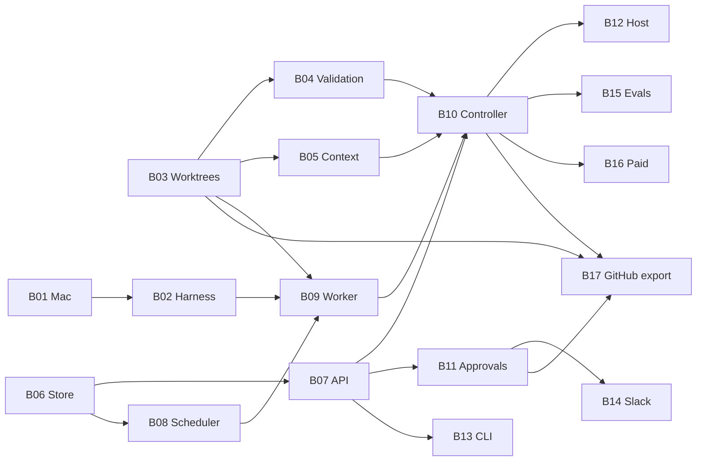

# Implementation backlog

Executable slices of [architecture.md](../architecture.md) §20. The
foundation scaffold (package layout, types, manifests, CLI help, config
templates) is already in the tree. B01–B16 are the remaining work to
reach MVP acceptance in architecture §21. B17 is post-MVP (ADR 0012)
and does not block §21.

Each item is one markdown file. **Status is the tracker.** Update the
item file and this table in the same PR that lands the work. Do not
open a parallel GitHub-issue backlog unless a human asks for one.

## How to execute an item

1. Confirm every **Depends on** item is `done` (or the item says a
   predecessor may be stubbed).
2. Copy the **Agentic prompt** at the bottom of that item file into a
   coding-agent session that has this repository checked out.
3. Implement only that item. Leave later items untouched.
4. Keep `make ci` green. Update `docs/setup.md` when operator status
   changes. Add an ADR if behavior would disagree with the spec.

## Status legend

| Status | Meaning |
| --- | --- |
| `planned` | Spec'd; not started |
| `blocked` | Waiting on a listed dependency |
| `in_progress` | A PR is implementing it |
| `done` | Acceptance criteria met on `main` |

## Items

| ID | Item | Phase | Depends on | Status |
| --- | --- | ---: | --- | --- |
| [B01](B01-mac-inference-appliance.md) | Mac inference appliance | 1 | — | done |
| [B02](B02-harness-provider-contracts.md) | Pin DeepSeek Harness and provider contracts | 2 | B01 (live); fixtures can start now | done |
| [B03](B03-worktree-workspace.md) | Git worktree workspace manager | 3 | — | done |
| [B04](B04-validation-engine.md) | Repository profiles and validation engine | 3 | B03 | done |
| [B05](B05-context-broker.md) | Context broker and structured task memory | 4 | B03 | done |
| [B06](B06-sqlite-store.md) | SQLite store, events, and leases | 5 | — | done |
| [B07](B07-control-api.md) | Channel-neutral control API | 5 | B06 | done |
| [B08](B08-scheduler.md) | Scheduler, single slot, and Mac health | 5 | B06 | done |
| [B09](B09-acp-worker.md) | ACP worker, action ledger, reconciliation | 5 | B02, B03, B06, B08 | done |
| [B10](B10-workflow-controller.md) | Workflow controller, budgets, review, reports | 5 | B04, B05, B07, B08, B09 | done |
| [B11](B11-questions-approvals.md) | Questions, approvals, pause/resume/cancel | 5 | B06, B07 | done |
| [B12](B12-dev-host-services.md) | Development-host services and Compose | 5 | B07, B08, B09, B10 | done |
| [B13](B13-cli-and-interaction.md) | CLI client and interaction-contract tests | 6 | B07 | done |
| [B14](B14-slack-adapter.md) | Slack MVP adapter | 6 | B07, B11 | planned |
| [B15](B15-evaluation-corpus.md) | Evaluation corpus and promotion gates | 5 / 18 | B03 (fixtures); B10–B12 (promotion) | done |
| [B16](B16-paid-model-routes.md) | Optional paid-model routes | 7 | B10 | planned |
| [B17](B17-github-export.md) | GitHub App source-control export | 8 | B03, B10, B11 | planned |

Optional thin web UI is a subsection of B13, not a second product.
B17 is parked: local worktree handoff remains the MVP.

## Recommended order

Default (matches architecture §20):

```text
B01 → B02 → B03 → B04 → B05 → B06 → B07 → B08 → B09 → B10 → B11 → B12 → B13 → B14 → B15 → B16 → B17
```

Safe parallelization while the tree is still a scaffold:



B01, B03, and B06 have no code dependencies on each other. An agent
without a Mac can still land B01 as dry-run scripts plus unit tests.

## Standing orders for every item

These apply even if an agentic prompt is pasted without this README:

- `docs/architecture.md` wins. Do not invent a second design.
- Python 3.12, `uv`, ruff, `mypy --strict` on `src/two`, pytest.
  `make ci` is the gate.
- Public types stay in `types.py` / `manifest.py` with no I/O. SQLite
  only in `store/`. CLI and `channels.*` stay thin.
- New source files need the Apache 2.0 header and
  `SPDX-License-Identifier: Apache-2.0`.
- Do not add a runtime dependency unless the item or an ADR allows it.
- Do not bind Ollama or the Majesta Two API to a public interface.
- Do not merge, push, release, or deploy from the agent loop
  (`workspace`, DSH, worker). Approved GitHub export is ADR 0012 /
  B17 and is not implemented; do not add `push` to B03.
- Do not reimplement the DeepSeek Harness agent loop.
- Slack is the MVP adapter only; this repo is the backend.
- Unit tests stay offline: no live Mac, Slack, Ollama, GitHub, or
  paid model.
