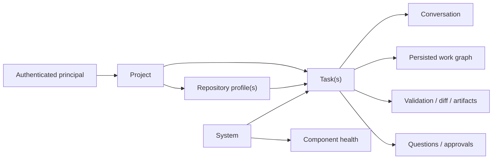

# Client API design

| Field | Value |
| --- | --- |
| Status | Slice 1 implemented (threat model, capabilities, principal/scopes, errors, idempotency, ETags). Slices 2–5 proposed. |
| Audience | CLI, first-party GUI/mobile, and future optional adapters |
| Authority | [Architecture §6.3.H](architecture.md), [ADR 0015](adrs/0015-first-party-client-api.md) |
| Existing contract | [B07](backlog/B07-control-api.md), `two.projection`, `/v1` |
| Planned client | [B14](backlog/B14-secure-mobile-client.md) |

## 1. Purpose

Majesta Two needs one client API that can support a useful development
workspace without moving workflow policy into a GUI. A client must be able to:

- hold a task-scoped conversation;
- discover and configure repositories and projects;
- see the persisted work graph, current node, budgets, diff, validation, and
  pending decisions;
- control a task and resolve questions or approvals;
- inspect controller, scheduler, worker, harness, inference, queue, disk, and
  store health;
- detach and reconnect without changing task execution.

The API remains the boundary around the durable controller. DeepSeek Harness
owns the model/tool loop. A GUI never calls Qwen, ACP, git, or a shell
directly, and client disconnect does not pause or cancel work.

## 2. Design principles

1. **Snapshot plus events.** Resource `GET`s provide authoritative snapshots.
   A redacted server-sent event stream provides low-latency changes. Reconnect
   always starts from a snapshot and a durable cursor.
2. **One task, one conversation, one graph.** Chat and controls attach to a
   stable task id. A review-only task is the conversational mode for
   investigation without writes; there is no separate chat-agent runtime.
3. **Typed writes.** Controls, config changes, answers, and approvals are
   typed requests. User text is data and is never interpolated into commands.
4. **Server-derived authority.** The server derives principal, roles, and
   scopes from authenticated identity. Network clients cannot choose their
   own `principal` or `actor`.
5. **Least disclosure.** List and notification payloads contain summaries.
   Source, diffs, logs, paths, and host details require explicit scopes and
   on-demand requests.
6. **Private reachability.** Unix socket and loopback remain the defaults.
   Mobile access uses an authenticated private overlay and HTTPS. The design
   does not authorize a public bind or public tunnel.
7. **Additive `/v1`.** Existing B07 routes and `TaskProjection` remain
   compatible. New optional fields and resources may land on `/v1`; a
   semantic break requires `/v2` and an ADR.
8. **No client-side source of truth.** Cached client data is a convenience.
   SQLite, worktrees, artifacts, and controller projections remain
   authoritative.

## 3. Resource model

### Repository

A repository resource is the API projection of an external repository
profile. It describes execution facts for one target repository:

- stable id and display name;
- availability and checkout/worktree-root status;
- default base ref;
- allowed and forbidden paths;
- validation profile and command names;
- instruction-file discovery;
- network and cloud policy;
- non-secret source-control metadata.

Repository responses sent to ordinary clients use logical ids and display
names. Canonical host paths, remote URLs, raw command strings, and instruction
contents are operator-only fields. Credentials and environment values are
never API fields.

### Project

A project is a client-facing organization and defaults resource, not another
workflow engine. It can group one or more repositories and store:

- stable id, display name, and description;
- member repository ids and default repository;
- default base ref, task mode, and execution profile;
- default acceptance-criteria templates and labels;
- notification preferences and client presentation settings;
- references to repository and policy revisions.

A project does not own worktrees, model sessions, graph nodes, or terminal
status. Tasks continue to carry the execution snapshot needed for
reproducibility. This design does not add a required field to `TaskManifest`;
an implementation may add an optional task association additively after its
manifest change is reviewed.

### Task and conversation

`TaskProjection` remains the primary task snapshot. Its persisted
`GraphView` is the plan/progress source of truth. The conversation is a
bounded, client-safe view over task messages and selected controller events:

- `user_message`;
- `agent_summary`;
- `stage_change`;
- `graph_change`;
- `question`;
- `approval`;
- `validation_summary`;
- `completion_report`;
- `system_notice`.

It is not the raw DeepSeek Harness trajectory. Reasoning traces, raw tool
payloads, environment values, and verbose command output never appear in the
conversation feed.

### System

System resources project operational state without exposing secrets:

- API and SQLite;
- scheduler, lease age, and queue depth;
- worker and current task/node;
- Harness process/version compatibility;
- inference endpoint health, model alias/digest match, and residency;
- disk capacity for data/worktrees/artifacts;
- latest observation time and stale/degraded reasons.

Health is observed state, not a command channel to Ollama or Harness.

## 4. HTTP surface

The table distinguishes the implemented B07 contract and B14 slice 1
foundations from later additive GUI resources. Exact Pydantic schemas live in
`two.projection` with contract tests. This document remains authoritative for
resource responsibilities and security behavior. The implementation threat
model is [client-threat-model.md](client-threat-model.md). OIDC/JWT libraries
are selected in [ADR 0016](adrs/0016-oidc-jwt-tls-dependencies.md) and are
**not** added until that ADR is accepted.

### Tasks, conversation, and development-loop monitoring

| Method | Path | Status | Purpose |
| --- | --- | --- | --- |
| `POST` | `/v1/tasks` | Existing | Create a durable task from `TaskManifest`. |
| `GET` | `/v1/tasks` | Existing; extend filters/cursor | List task summaries by project, repository, lifecycle, and update time. |
| `GET` | `/v1/tasks/{id}` | Existing | Authoritative projection including graph, budgets, questions, approvals, diff and validation summaries. |
| `GET` | `/v1/tasks/{id}/events` | Existing operator route; hardening proposed | Append-only controller events. Today the shared bearer can read it; B14 must require `events:audit` and policy filtering before mobile access is enabled. |
| `POST` | `/v1/tasks/{id}/messages` | Existing; add idempotency | Add user text to the durable task conversation. |
| `GET` | `/v1/tasks/{id}/conversation` | Proposed | Page through client-safe conversation items with a durable cursor. |
| `GET` | `/v1/tasks/{id}/stream` | Proposed | SSE stream of redacted task changes; supports `Last-Event-ID`. |
| `GET` | `/v1/stream` | Proposed | SSE stream of authorized task-list and system-summary changes. |
| `POST` | `/v1/tasks/{id}/pause` | Existing | Request cooperative pause. |
| `POST` | `/v1/tasks/{id}/resume` | Existing | Requeue a resumable task. |
| `POST` | `/v1/tasks/{id}/cancel` | Existing | Request cooperative cancellation. |
| `POST` | `/v1/tasks/{id}/questions/{qid}/answer` | Existing | Resolve one durable question, first writer wins. |
| `POST` | `/v1/tasks/{id}/approvals/{aid}/decide` | Existing | Decide one immutable action digest. |
| `GET` | `/v1/tasks/{id}/report` | Existing | Fetch the Stage 8 report. |
| `GET` | `/v1/tasks/{id}/diff` | Proposed | Fetch a bounded, policy-filtered unified diff or file summary. |
| `GET` | `/v1/tasks/{id}/artifacts` | Proposed | List safe artifact metadata. |
| `GET` | `/v1/tasks/{id}/artifacts/{artifact_id}` | Proposed | Download an authorized bounded artifact; no arbitrary filesystem path. |

SSE carries controller changes, not model tokens. Every stream event contains
an opaque cursor, resource id, event kind, resource revision, and minimal
summary. The client refetches the affected resource for authoritative state.
Slow consumers may be disconnected and resume from `Last-Event-ID`. If the
cursor is outside retention, the server returns a reset event and the client
reloads snapshots.

### Repository and project configuration

| Method | Path | Purpose |
| --- | --- | --- |
| `GET` | `/v1/repositories` | List authorized repository summaries and readiness. |
| `GET` | `/v1/repositories/{id}` | Fetch active, redacted configuration and revision. |
| `POST` | `/v1/repositories/{id}/config-candidates` | Validate an immutable candidate and return field-level errors, risk class, digest, and redacted diff. |
| `POST` | `/v1/repositories/{id}/config-candidates/{revision}/activate` | Activate the exact candidate immediately or create a required approval. |
| `GET` | `/v1/projects` | List authorized projects and aggregate task counts. |
| `POST` | `/v1/projects` | Create a project from typed, non-secret fields. |
| `GET` | `/v1/projects/{id}` | Fetch project defaults, repository membership, and revision. |
| `POST` | `/v1/projects/{id}/config-candidates` | Validate an immutable project candidate. |
| `POST` | `/v1/projects/{id}/config-candidates/{revision}/activate` | Activate the exact candidate subject to policy. |

Configuration uses immutable candidates rather than allowing a GUI to edit
host YAML or arbitrary paths. Candidate activation uses optimistic
concurrency (`If-Match` against the active revision). A changed candidate has
a new digest and cannot reuse an old approval.

Changes to display metadata and task defaults may activate directly for an
authorized editor. Changes that expand execution capability—repository root,
remote, validation commands, allowed paths, network/cloud policy, or secret
references—require an `admin` scope and a digest-scoped approval. Policy may
require that approval to occur through a local operator session. The API
never accepts a secret value; it accepts only a pre-existing server-side
secret reference where a future feature explicitly permits one.

### System health and capability discovery

| Method | Path | Status | Purpose |
| --- | --- | --- | --- |
| `GET` | `/health` | Existing | Shallow API/store liveness; loopback/service-manager use. |
| `GET` | `/v1/system/health` | Proposed | Authenticated aggregate component health and observation freshness. |
| `GET` | `/v1/system/capabilities` | Implemented (B14 slice 1) | API versions, auth method, scopes, and optional features available to this client. |
| `GET` | `/v1/system/queue` | Proposed | Redacted queue order, active slot, retry waits, and lease freshness. |

Clients feature-detect through capabilities; they do not infer support from
server version strings. Health responses distinguish `healthy`, `degraded`,
`unavailable`, and `unknown`, include `observed_at`, and never claim fresh
health from stale cached observations.

## 5. Consistency, idempotency, and errors

Slice 1 implements the following on existing `/v1` mutations and task
projections. CLI callers that omit the new headers keep working.

- Every mutable task resource has a monotonic `revision` and `ETag`.
- Config activation and other lost-update-sensitive writes require
  `If-Match`; mismatch is `412 Precondition Failed`. Existing B07
  mutations accept optional `If-Match`; absence is not a precondition failure.
- Every client mutation accepts `Idempotency-Key`. Reusing a key with the
  same principal and body returns the original result; reusing it with a
  different body is `409 Conflict` (`idempotency_conflict`).
- Task event sequence remains ordered per task. No global total order is
  promised.
- Creation acknowledges only after durable persistence.
- Errors keep the B07 `error.code` envelope and add optional
  `correlation_id`, `field_errors`, and `retry_after_seconds`.
- `401` means authentication is absent/invalid; `403` means the authenticated
  principal lacks scope; `409` means lifecycle/digest/idempotency conflict;
  `412` means stale resource revision; `429` carries bounded retry guidance.

## 6. Authentication and authorization

### Deployment boundary

- Unix socket or loopback remains the normal CLI path.
- A mobile client reaches HTTPS only over a private Tailscale/WireGuard
  overlay. Public internet binds, public tunnels, and direct Ollama access
  remain forbidden.
- The current shared `TWO_API_TOKEN` is a transitional single-operator
  mechanism for trusted CLI/overlay use. It must not be copied into or
  embedded in the mobile app.

Today that bearer is coarse authentication, not multi-user authorization.
B14 slice 1 derives the network principal as `token:operator` and attaches
the full operator scope set. Request `principal`/`actor` fields cannot
establish authority for authenticated network clients. They remain audit
labels for trusted Unix/loopback callers. `/v1/tasks/{id}/events` requires
`events:audit` (granted to local-trust and the shared operator token).
Do not embed the token in a mobile app or grant it to mutually untrusted
users.

### Mobile identity

The first-party native app is an OAuth 2.1 public client using Authorization
Code with PKCE against an operator-configured OIDC issuer. It has no client
secret. Access tokens are short-lived; refresh tokens rotate and are stored
only in iOS Keychain or Android Keystore with device-unlock protection.
Logout or server-side device revocation invalidates the session.

If an installation has no configured trusted issuer, mobile sign-in is
unavailable; the server fails closed and CLI/Unix access remains available.
The implementation must validate issuer, audience, expiry, signature,
authorized-party/client id, and PKCE flow. It must not invent a custom
password or cryptographic protocol inside the app.

### Roles and scopes

Suggested scopes:

| Scope | Allows |
| --- | --- |
| `tasks:read` | Task lists, projections, conversation summaries, graph, reports. |
| `tasks:message` | Post task messages and answer ordinary questions. |
| `tasks:control` | Submit, pause, resume, and cancel tasks. |
| `approvals:decide` | Approve/reject exact action digests; may require recent sign-in. |
| `source:read` | Request bounded diffs, paths, and source-bearing artifacts. |
| `events:audit` | Read policy-filtered controller events; never raw Harness trajectories. |
| `config:read` | Read redacted repository/project configuration. |
| `config:write` | Draft and activate permitted config candidates. |
| `system:read` | Aggregate health and queue summaries. |
| `admin` | Sensitive config and device/session administration; never implicit. |

Target behavior: the server computes the effective principal and scopes.
Existing request `actor`/`principal` fields are ignored for authenticated
network clients. Trusted in-process/Unix callers may still send those labels
for CLI audit compatibility; scopes stay server-derived.

Approval screens show action class, target, paths, digest, requesting stage,
and consequences. Approval requires a fresh projection and cannot be queued
offline. High-risk policy may require recent authentication or local
operator confirmation. Silence and notification taps are never approval.

## 7. Data minimization and mobile behavior

- Task lists omit objective text by default when the device is locked or the
  caller lacks the relevant disclosure scope.
- Push notifications are optional and carry only an opaque task id and
  coarse event class. APNs/FCM never receive repository names, source,
  objectives, diffs, logs, approval details, or auth tokens. The app fetches
  details after unlock.
- The app may keep a small encrypted cache for reconnect UX. Signing out or
  revocation clears keys and cached source-bearing data.
- Screenshots, clipboard copy, OS backups, and diagnostic logs must avoid
  source-bearing data where each mobile platform permits.
- Background refresh can update counts and coarse state, but cannot answer,
  approve, mutate config, or start tasks without foreground user action.
- Artifact and diff downloads are bounded, auditable, policy-filtered, and
  addressed by server ids—not host filesystem paths.

## 8. GUI interaction model

The intended GUI has five primary views:

1. **Projects** — project defaults, repository readiness, active/recent tasks.
2. **Task conversation** — durable messages, questions, approvals, and
   concise system notices.
3. **Development loop** — graph visualization, current node, dependency
   reason, stage, active command summary, budgets, and retry/blocked state.
4. **Evidence** — changed-file statistics, bounded diff, validation gates,
   report, and safe artifacts.
5. **System** — API/store/scheduler/worker/harness/inference/queue/disk health
   with observation age.

The graph is rendered from `TaskProjection.graph`; the UI does not derive a
plan from chat prose. The conversation and graph cross-link by task event
cursor and node id. A refresh can reconstruct every view from API snapshots.
Until B19 persists a graph, `graph` may be `null`. Client API work must not
wait on that field.

## 9. Delivery boundaries

This design intentionally does not:

- add code or claim that proposed routes exist;
- replace the current CLI or B07 routes;
- make the mobile app the controller or task store;
- expose raw DSH trajectories or token streaming;
- put repository credentials, cloud secrets, or validation execution in a
  client;
- add a required `TaskManifest` field;
- publish the API to the internet;
- implement Slack. Slack may return later as an optional adapter using the
  same redacted resources and scoped identity model.

Implementation should be sliced into: contract/auth foundations (slice 1,
landed), read-only GUI projections and SSE, typed config candidates, then
the separate native mobile client. B19 is parallel work; it is not a start
gate for those API slices. Each slice needs offline contract tests;
remote auth and mobile security require dedicated integration and
threat-model review before promotion. Do not add PyJWT or TLS libraries
until ADR 0016 is accepted.
